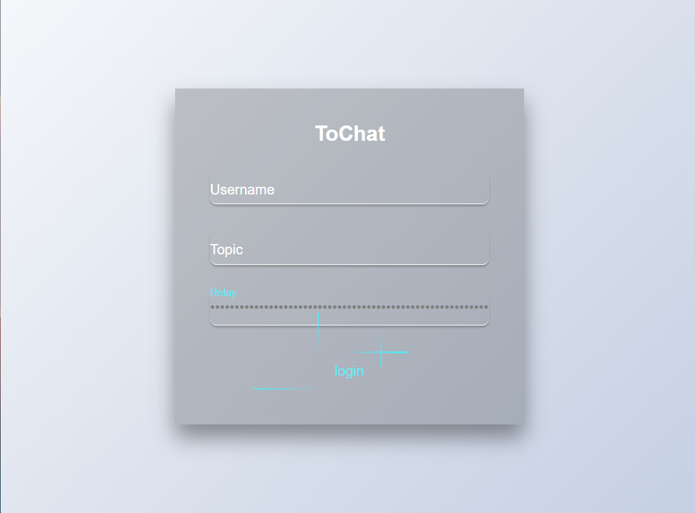
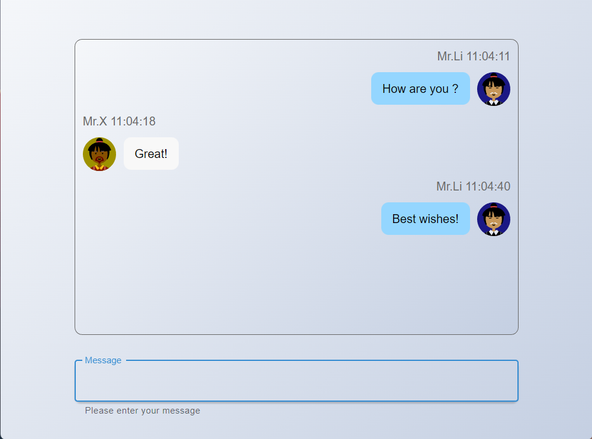

# ToChat

A Distributed Peer-to-Peer instant messaging **GUI** application built on libp2p.




This project is based on **"Tauri + React + Libp2p"**.

For its origin Tui version, see [tochat-tui](https://github.com/Collapssar/tochat-tui).

To build from source, pull the code and execute:
```shell
$ yarn tauri build
```


## Download installers:
go to [releases](https://github.com/Collapssar/testing/releases).
